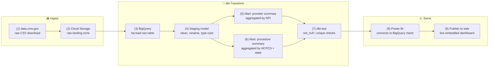
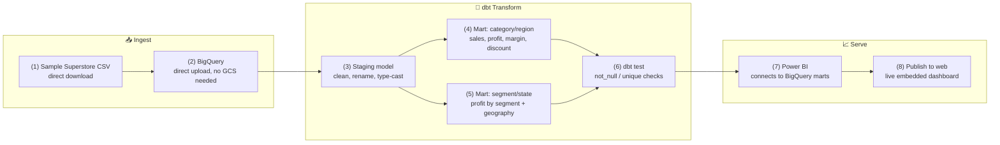
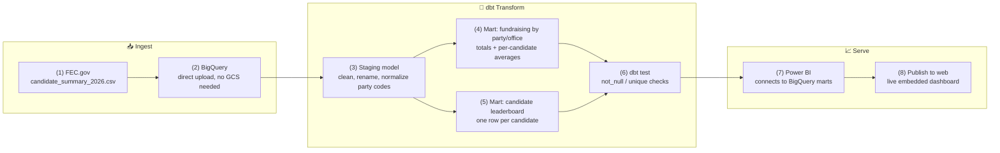
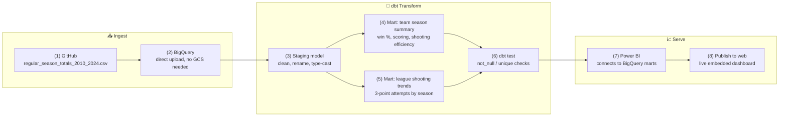
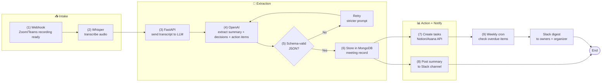

# 🧠 AI Automation & Data Engineering Projects
A collection of builds spanning two disciplines: **AI-powered automation** — LLM-driven document processing, agentic workflows, and human-in-the-loop approval systems — and **end-to-end data engineering**, carrying raw data from source through BigQuery and dbt to live production dashboards in Power BI.

---

## 📊 Medicare Data Pipeline: Raw Data to Production Dashboard {#medicare-data-pipeline}
**Type:** Data Engineering / Cloud Data Pipeline
**Stack:** Google Cloud Storage, BigQuery, dbt, Power BI
**Code:** [View on GitHub](https://github.com/mhallingquest/data-analytics/tree/main/medicare-data-pipeline)

A real, working pipeline built on public CMS Medicare provider/payment
data — de-identified, public-domain data, no PII — carried end to end from
raw CSV to a live production dashboard. Built specifically to demonstrate
cloud-native data warehousing and transformation (BigQuery + dbt), not just
a script that reads a CSV.

**Highlights**
- Raw CMS provider/service data (millions of rows) landed in Cloud Storage, loaded to BigQuery, modeled with dbt
- Staging layer normalizes and types raw fields; production marts aggregate to provider- and procedure-level summaries
- dbt-defined tests (not_null, unique) enforce data quality on every run
- Power BI connects directly to the BigQuery production marts — no manual export/import step

### 🧩 Workflow Diagram

### 📊 Medicare Data Pipeline — Diagram

**Workflow Steps**

1. **Source:** Download the CMS "Medicare Physician & Other Practitioners - by Provider and Service" CSV from data.cms.gov
2. **Land:** Upload the raw file to a Cloud Storage bucket — the raw, untouched landing zone
3. **Load:** `bq load` the CSV into a raw BigQuery table, no transformation yet
4. **Stage:** dbt staging model cleans column names, casts types, filters obvious nulls — no business logic
5. **Model (provider):** dbt mart aggregates to one row per provider (NPI) — total services, beneficiaries, Medicare payments
6. **Model (procedure):** dbt mart aggregates to one row per (procedure code, state) — cost and volume by geography
7. **Test:** dbt's built-in test framework enforces not_null/unique constraints on key columns before the marts are trusted downstream
8. **Connect:** Power BI connects directly to the BigQuery production marts — no CSV export step in between
9. **Publish:** Power BI's "Publish to web" generates a live, filterable embed for the portfolio site

<!-- Live Demo: paste your Power BI "Publish to web" iframe embed code here.
     It looks like:
     <iframe title="Medicare Dashboard" width="100%" height="600"
       src="https://app.powerbi.com/view?r=YOUR_EMBED_TOKEN"
       frameborder="0" allowFullScreen="true"></iframe>

     Example wrapper matching the other project sections' styling: -->

  
🎬 Try it live

  

    This is the actual production Power BI dashboard, built on the pipeline
    above — filter and explore it directly.
  

  

    <iframe
      title="Medicare Provider & Procedure Dashboard"
      style="position:absolute; top:0; left:0; width:100%; height:100%;"
      src="https://app.powerbi.com/view?r=eyJrIjoiZDA1ZTkyMmYtZDNiMS00YmYyLTg4OGQtOTU5MTlkNGVhOTE4IiwidCI6IjQyNmVjMmY0LTM5YTgtNGE2ZS1iZmI5LTRlMDE5OGJkYTg2NyIsImMiOjF9"
      frameborder="0"
      allowFullScreen="true">
    </iframe>
  

## 📈 Superstore Sales & Profitability Dashboard {#superstore-sales-dashboard}
**Type:** Data Engineering / Cloud Data Pipeline
**Stack:** BigQuery, dbt, Power BI
**Code:** [View on GitHub](https://github.com/mhallingquest/data-analytics/tree/main/superstore-sales-pipeline)

A complete, working pipeline built on the Sample Superstore dataset — sales,
profit, and discount data across product categories, regions, and customer
segments — carried from a raw CSV straight through to a live production
dashboard. Deliberately chosen after an earlier attempt (GA4 e-commerce
data) turned out to have deliberately-stripped pricing fields — this
dataset is complete by design, letting the analysis focus on the actual
business question instead of working around missing data.

**Highlights**
- Direct CSV upload straight into BigQuery — no Cloud Storage step needed at this scale
- dbt staging layer normalizes raw column names (including literal spaces/hyphens from the source CSV) before any business logic runs
- Two production marts: category/region profitability, and segment/state performance
- Reveals a real, visible pattern in the data — heavier discounting correlates with lower profit margin, and it hits some categories far harder than others
- Grouping logic applied defensively from the start (using `ANY_VALUE()` for descriptive fields rather than a fragile composite key) — a lesson carried over from an earlier project rather than learned the hard way twice

### 🧩 Workflow Diagram

### 📈 Superstore Pipeline — Diagram

**Workflow Steps**

1. **Source:** Download the Sample Superstore CSV (complete, no missing-by-design fields)
2. **Load:** Direct upload into BigQuery — small enough to skip Cloud Storage entirely
3. **Stage:** dbt staging model cleans column names (including literal spaces/hyphens from the raw headers) and casts types
4. **Model (category/region):** dbt mart aggregates sales, profit, quantity, discount, and margin by category, sub-category, and region
5. **Model (segment/state):** dbt mart aggregates the same metrics by customer segment and state
6. **Test:** dbt's test framework enforces not_null/unique constraints before the marts are trusted downstream
7. **Connect:** Power BI connects directly to the BigQuery production marts
8. **Publish:** Power BI's "Publish to web" generates a live, filterable embed for the portfolio site

  
🎬 Try it live

  

    The actual production Power BI dashboard, built on the pipeline above —
    filter by segment and explore it directly.
  

  

    <iframe
      title="Superstore Sales & Profitability Dashboard"
      style="position:absolute; top:0; left:0; width:100%; height:100%;"
      src="https://app.powerbi.com/view?r=eyJrIjoiY2NjYmQ5MDYtYWRjNS00ZWM4LWJiNWYtMDBkNWUyMjhiMTI1IiwidCI6IjQyNmVjMmY0LTM5YTgtNGE2ZS1iZmI5LTRlMDE5OGJkYTg2NyIsImMiOjF9"
      frameborder="0"
      allowFullScreen="true">
    </iframe>
  

---

## 🗳️ 2026 Congressional Campaign Finance Dashboard {#fec-campaign-finance-dashboard}
**Type:** Data Engineering / Cloud Data Pipeline
**Stack:** BigQuery, dbt, Power BI
**Code:** [View on GitHub](https://github.com/mhallingquest/data-analytics/tree/main/fec-campaign-finance-pipeline)

A pipeline built on genuinely live, current data — real 2025-2026 federal
election cycle campaign finance filings, downloaded directly from the FEC's
official bulk data files and carried through to a live production
dashboard. Unlike the other pipelines in this portfolio, this one tracks an
active, ongoing dataset that updates as new filings are received, rather
than a static historical snapshot.

**Highlights**
- Built against the FEC's exact real column schema, verified directly against the source file before writing any SQL — no guess-and-fix iteration needed
- Reveals a genuinely contrasting story: House races raise more total dollars, but Senate candidates raise more per-candidate on average — visible side by side in two deliberately paired charts
- Surfaces the well-documented incumbency advantage clearly: incumbents outraise both open-seat and challenger candidates by a wide margin
- Party codes normalized at the source layer (e.g., Minnesota's "DFL" folded into "DEM") so downstream charts tell an accurate national story

### 🧩 Workflow Diagram

### 🗳️ FEC Campaign Finance Pipeline — Diagram

**Workflow Steps**

1. **Source:** Download the FEC's official "candidate_summary_2026.csv" bulk data file for the 2025-2026 election cycle
2. **Load:** Direct upload into BigQuery — small enough to skip Cloud Storage entirely
3. **Stage:** dbt staging model cleans column names, casts types, and normalizes party affiliation codes (e.g., DFL → DEM) and office codes (H/S/P → House/Senate/President)
4. **Model (fundraising):** dbt mart aggregates receipts, disbursements, and cash-on-hand by party and office, including both totals and per-candidate averages
5. **Model (leaderboard):** dbt mart produces one row per candidate, grouped defensively by the reliable `candidate_id` field
6. **Test:** dbt's test framework enforces not_null/unique constraints before the marts are trusted downstream
7. **Connect:** Power BI connects directly to the BigQuery production marts
8. **Publish:** Power BI's "Publish to web" generates a live, filterable embed for the portfolio site

  
🎬 Try it live

  

    The actual production Power BI dashboard, built on genuinely live 2026
    election cycle data — explore it directly.
  

  

    <iframe
      title="2026 Congressional Campaign Finance Dashboard"
      style="position:absolute; top:0; left:0; width:100%; height:100%;"
      src="https://app.powerbi.com/view?r=eyJrIjoiMDE4ZjE1MTktMTBkNi00NDhlLThkOTctZTkzMTI2ZDJmNDBiIiwidCI6IjQyNmVjMmY0LTM5YTgtNGE2ZS1iZmI5LTRlMDE5OGJkYTg2NyIsImMiOjF9&pageName=5c472640cd1d16085601"
      frameborder="0"
      allowFullScreen="true">
    </iframe>
  

---

## 🏀 NBA Team Performance & Shooting Trends {#nba-team-stats-dashboard}
**Type:** Data Engineering / Cloud Data Pipeline
**Stack:** BigQuery, dbt, Power BI
**Code:** [View on GitHub](https://github.com/mhallingquest/data-analytics/tree/main/nba-team-stats-pipeline)

A pipeline built on real NBA team game data spanning 2010-2024 — fourteen
regular seasons carried from a public, actively-maintained GitHub dataset
through to a live production dashboard, tracking the sport's most
significant modern tactical shift: the rise of the three-point shot.

**Highlights**
- Built against a fully-documented public schema, verified directly against the source repo before writing any SQL
- League-wide shooting trends reveal the well-documented "3-point revolution" — average 3-point attempts per team climbing steadily across the full 2010-2024 span
- Team-level win percentage, scoring, and point differential tracked season over season, filterable by team
- `PLUS_MINUS` used directly for point differential, avoiding an unnecessary self-join against opponent data

### 🧩 Workflow Diagram

### 🏀 NBA Team Stats Pipeline — Diagram

**Workflow Steps**

1. **Source:** Download "regular_season_totals_2010_2024.csv" from the publicly maintained NocturneBear/NBA-Data-2010-2024 GitHub repository
2. **Load:** Direct upload into BigQuery — no Cloud Storage step needed at this file size
3. **Stage:** dbt staging model cleans column names and casts types against the source's own documented schema
4. **Model (team season):** dbt mart aggregates wins, losses, win percentage, scoring, and shooting efficiency by team and season
5. **Model (league trends):** dbt mart aggregates league-wide shooting and scoring averages by season, surfacing the 3-point attempt trend
6. **Test:** dbt's test framework enforces not_null/unique constraints before the marts are trusted downstream
7. **Connect:** Power BI connects directly to the BigQuery production marts
8. **Publish:** Power BI's "Publish to web" generates a live, filterable embed for the portfolio site

  
🎬 Try it live

  

    The actual production Power BI dashboard, built on the pipeline above —
    filter by team and explore fourteen seasons of shooting trends directly.
  

  

    <iframe
      title="NBA Team Performance & Shooting Trends"
      style="position:absolute; top:0; left:0; width:100%; height:100%;"
      src="https://app.powerbi.com/view?r=eyJrIjoiN2Q1Zjc5NjAtOGM2NS00MjAwLTk4ZWEtMjYzMmExM2RjYjlhIiwidCI6IjQyNmVjMmY0LTM5YTgtNGE2ZS1iZmI5LTRlMDE5OGJkYTg2NyIsImMiOjF9"
      frameborder="0"
      allowFullScreen="true">
    </iframe>
  

---

## 🎯 March Madness ML: 2025 NCAA Bracket Predictions {#march-madness-ml}
**Type:** Machine Learning / Predictive Modeling
**Stack:** Python, pandas, scikit-learn, XGBoost
**Code:** [View on GitHub](https://github.com/mhallingquest/data-analytics/tree/main/march-madness-ml)

A machine learning pipeline trained blind on NCAA tournament data through
2024 — from the official Kaggle "March Machine Learning Mania" competition
dataset, frozen right before Selection Sunday 2025 — then scored against
the real 2025 tournament results once they'd actually happened. Both
Men's and Women's brackets.

**Highlights**
- Feature engineering across 7,981 (Men's) and 5,602 (Women's) team-seasons of real box score data
- Two models compared head-to-head (Logistic Regression, XGBoost) with proper time-based validation — trained on older seasons, tested on held-out recent ones, not randomly shuffled
- **Real-world validation:** predicted the entire 2025 bracket before it played out, then checked against actual results — 12/14 (85.7%) correct across the Elite Eight through Championship, including a perfect 7/7 on the Women's side

### 🧩 Workflow Diagram

### 🎯 March Madness ML — Diagram

```mermaid
%%{init: {'flowchart': { 'htmlLabels': true, 'wrap': true, 'nodeSpacing': 60, 'rankSpacing': 80 }}}%%
flowchart LR
  subgraph Features [📥 Feature Engineering]
    A1["(1) Kaggle dataset<br/>box scores through 2024"]
    A2["(2) Per-team-season stats<br/>win%, shooting, rebounds, etc."]
    A1 --> A2
  end

  subgraph Training [🧠 Model Training]
    A2 --> B1["(3) Matchup training data<br/>symmetric augmentation"]
    B1 --> B2["(4) Train + validate<br/>LogReg vs XGBoost, time-split"]
  end

  subgraph Predict [🔮 2025 Predictions]
    B2 --> C1["(5) Every possible matchup<br/>among 68 tournament teams"]
    C1 --> C2["(6) Simulate real bracket<br/>round by round"]
  end

  subgraph Validate [✅ Real-World Scoring]
    C2 --> D1["(7) Fetch actual 2025 results<br/>after the tournament happened"]
    D1 --> D2["(8) Score predictions<br/>vs. real outcomes"]
  end

```

**Workflow Steps**

1. **Source:** Kaggle's official "March Machine Learning Mania 2025" competition dataset — frozen before the 2025 tournament, so 2025 results genuinely weren't in the training data
2. **Feature engineering:** aggregate each team's season stats (win %, scoring, shooting efficiency, rebounding, turnovers) from game-level box scores
3. **Training data:** historical tournament games become matchup rows, symmetrically augmented (each game contributes one "Team A wins" and one "Team B wins" row) to avoid team-order bias
4. **Train & validate:** Logistic Regression and XGBoost, evaluated on held-out recent tournament seasons — not a random split, which would leak future information
5. **Generate 2025 predictions:** win probability for every possible pairing among the 68 tournament teams
6. **Simulate the bracket:** walk the real slot structure (First Four through Championship) round by round, advancing the higher-probability team at each step
7. **Fetch real results:** once the 2025 tournament had actually happened, pull the real outcomes from published sources
8. **Score:** compare blind predictions against real results — 12/14 correct across the Elite Eight through Championship

  
🏀 Predictions vs. What Actually Happened

  

    Trained blind on data through 2024, then scored against the real 2025 tournament outcomes.
  

  

    

      
Backtested Accuracy (Men's)

      
67.9%

      
vs. 68.3% seed-only baseline

    

    

      
Backtested Accuracy (Women's)

      
81.3%

      
vs. 77.2% seed-only baseline

    

    

      
2025 Real Results (Combined)

      
12 / 14

      
Elite Eight through Championship

    

  

  

    

      
🏀 Men's Bracket — 5/7 correct

      <table style="width:100%; border-collapse:collapse; font-size:0.85rem;">
        <tr style="text-align:left; opacity:0.7; border-bottom:1px solid #444;">
          <th style="padding:6px 4px;">Round</th><th>Our Pick</th><th>Actual</th><th style="text-align:center;">✓</th>
        </tr>
        <tr style="border-bottom:1px solid #333;"><td style="padding:6px 4px;">Elite 8</td><td>Florida</td><td>Florida</td><td style="text-align:center; color:#4caf50;">✓</td></tr>
        <tr style="border-bottom:1px solid #333;"><td style="padding:6px 4px;">Elite 8</td><td>Duke</td><td>Duke</td><td style="text-align:center; color:#4caf50;">✓</td></tr>
        <tr style="border-bottom:1px solid #333;"><td style="padding:6px 4px;">Elite 8</td><td>Auburn</td><td>Auburn</td><td style="text-align:center; color:#4caf50;">✓</td></tr>
        <tr style="border-bottom:1px solid #333;"><td style="padding:6px 4px;">Elite 8</td><td>Houston</td><td>Houston</td><td style="text-align:center; color:#4caf50;">✓</td></tr>
        <tr style="border-bottom:1px solid #333;"><td style="padding:6px 4px;">Final Four</td><td>Houston</td><td>Houston</td><td style="text-align:center; color:#4caf50;">✓</td></tr>
        <tr style="border-bottom:1px solid #333;"><td style="padding:6px 4px;">Final Four</td><td>Auburn</td><td>Florida</td><td style="text-align:center; color:#e57373;">✗</td></tr>
        <tr><td style="padding:6px 4px;">Champion</td><td>Houston</td><td>Florida</td><td style="text-align:center; color:#e57373;">✗</td></tr>
      </table>
      
Correctly called all four Elite Eight winners, matching the historic all-#1-seed Final Four. Picked the actual national runner-up as champion.

    

    

      
🏀 Women's Bracket — 7/7 correct

      <table style="width:100%; border-collapse:collapse; font-size:0.85rem;">
        <tr style="text-align:left; opacity:0.7; border-bottom:1px solid #444;">
          <th style="padding:6px 4px;">Round</th><th>Our Pick</th><th>Actual</th><th style="text-align:center;">✓</th>
        </tr>
        <tr style="border-bottom:1px solid #333;"><td style="padding:6px 4px;">Elite 8</td><td>UConn</td><td>UConn</td><td style="text-align:center; color:#4caf50;">✓</td></tr>
        <tr style="border-bottom:1px solid #333;"><td style="padding:6px 4px;">Elite 8</td><td>S. Carolina</td><td>S. Carolina</td><td style="text-align:center; color:#4caf50;">✓</td></tr>
        <tr style="border-bottom:1px solid #333;"><td style="padding:6px 4px;">Elite 8</td><td>UCLA</td><td>UCLA</td><td style="text-align:center; color:#4caf50;">✓</td></tr>
        <tr style="border-bottom:1px solid #333;"><td style="padding:6px 4px;">Elite 8</td><td>Texas</td><td>Texas</td><td style="text-align:center; color:#4caf50;">✓</td></tr>
        <tr style="border-bottom:1px solid #333;"><td style="padding:6px 4px;">Final Four</td><td>S. Carolina</td><td>S. Carolina</td><td style="text-align:center; color:#4caf50;">✓</td></tr>
        <tr style="border-bottom:1px solid #333;"><td style="padding:6px 4px;">Final Four</td><td>UConn</td><td>UConn</td><td style="text-align:center; color:#4caf50;">✓</td></tr>
        <tr><td style="padding:6px 4px;">Champion</td><td>UConn</td><td>UConn</td><td style="text-align:center; color:#4caf50;">✓</td></tr>
      </table>
      
Perfect: all four Elite Eight winners, both Final Four semifinal winners, and the eventual champion — all called correctly, blind, before the tournament played out.

    

  

  

    Scoring covers the Elite Eight through Championship (the rounds that decide the tournament), sourced from published game results. Earlier rounds (First/Second Round, Sweet 16) weren't individually re-verified against game-by-game results for this summary.
  

---

## ⚙️ Contract Processing Bot {#contract-processing-bot}
**Type:** Document Intelligence  
**Stack:** Zapier, OpenAI, Google Drive, Gmail, Slack, Google Sheets  

This bot automates contract intake and review—extracting key clauses, identifying risks, logging results, and routing approvals.

**Highlights**
- 80–90% reduction in contract triage time  
- Real-time Slack alerts for risky clauses  
- Seamless Google Drive + Sheets tracking

### 🧩 Workflow Diagram

### ⚙️ Contract Processing Bot — Diagram

**Workflow Steps**

1. **Trigger:** Gmail — new attachment containing “contract”
2. **Notify:** Send immediate Slack notification (intake)
3. **Filter:** Only process contract files (skip & log others)
4. **Store:** Upload to Google Drive → `/Contracts/Incoming`
5. **Extract:** OpenAI step creates JSON summary (parties, dates, amounts, renewal, risks)
6. **Parse:** Code by Zapier converts JSON to typed fields
7. **Log:** Append all run details to Google Sheets
8. **Route:** If risks found → Slack human review thread; else continue
9. **Confirm:** Send email confirmations for auto-approved contracts

  
🎬 Try it live

  

    Paste contract text (or use the example below) and this calls the
    actual deployed FastAPI backend — not a canned response.
  

    

    ⚠️ <strong>Not legal advice.</strong> This is a demo of an AI document-scanning
    tool, not a substitute for review by a licensed attorney. Do not rely on
    its output for real contract decisions.
  

  <textarea id="contract-demo-input" rows="8" style="width:100%; box-sizing:border-box; font-family:inherit; padding:0.6rem; border-radius:6px; border:1px solid #555; background:rgba(0,0,0,0.2); color:inherit;">This Software Subscription Agreement ("Agreement") is entered into as of January 1, 2026 by and between Acme Corp ("Client") and Beta LLC ("Provider"). Provider shall provide access to its software platform for a monthly fee of $2,500, payable on the 1st of each month. A late payment fee of $150 applies to payments received more than 5 days after the due date. This Agreement shall commence on the Effective Date and continue until December 31, 2026, and shall automatically renew for successive 12-month terms unless either party provides written notice of non-renewal at least 30 days prior to the end of the then-current term. Provider's total liability under this Agreement shall not exceed the fees paid by Client in the month immediately preceding the claim.</textarea>
  

    <button id="contract-demo-btn" style="padding:0.5rem 1.1rem; border-radius:6px; border:none; background:#4f7cff; color:white; cursor:pointer; font-weight:600;">
      Run Live Demo
    </button>
    
  

  

---

## 📧 Support Email Agent {#support-email-agent}
**Type:** Agentic Workflow  
**Stack:** Zapier, OpenAI, Gmail, Zendesk, Slack, Google Sheets  

This agent triages every inbound support email, drafts a reply grounded in your knowledge base, and routes anything customer-facing through a one-click Slack approval before it ever leaves the outbox.

**Highlights**
- 24/7 first-response coverage — no ticket sits untouched overnight  
- Human-in-the-loop approval keeps a person accountable for every reply  
- Confidence-based routing sends only low-risk replies (e.g., password resets) automatically  
- Daily Slack digest tracks response time and escalation rate

### 🧩 Workflow Diagram

### 📧 Support Email Agent — Diagram

**Workflow Steps**

1. **Trigger:** Gmail/Zendesk — new inbound support email
2. **Classify:** OpenAI scores intent (billing, technical, general) and urgency
3. **Escalation check:** Refund/cancel/legal/angry-sentiment keywords route straight to a human, bypassing AI drafting
4. **Retrieve:** Pull the matching FAQ/knowledge-base article via lookup table
5. **Draft:** OpenAI generates a reply grounded in the matched KB content, in brand voice
6. **Confidence check:** Low-risk, high-confidence replies (e.g., password reset) go straight to send
7. **Human-in-the-loop:** Everything else posts to a Slack thread with Approve / Edit / Reject actions
8. **Send:** Approved replies go out via the Gmail/Zendesk API
9. **Log & report:** Every reply logged to Sheets; daily Slack digest shows volume, response time, escalation rate

---

## 🗒️ Meeting Intelligence & Action-Item Agent {#meeting-intelligence-agent}
**Type:** Agentic Workflow + Document Intelligence  
**Stack:** FastAPI, OpenAI (GPT-4o-mini), Whisper, MongoDB, Slack API, Notion/Asana API  

Meetings generate decisions and action items that usually die in someone's notes app. This service listens for a finished meeting, turns the recording or transcript into structured minutes, and pushes every action item — with an owner and a due date — straight into the team's task tool.

**Highlights**
- Cuts meeting write-up time from ~20 minutes to under 2  
- Action items land in Notion/Asana automatically, no manual re-typing  
- Weekly rollup flags overdue items by owner, closing the accountability gap  
- Searchable meeting history in MongoDB — "what did we decide about X?" answered in seconds

### 🧩 Workflow Diagram

### 🗒️ Meeting Intelligence Agent — Diagram

**Workflow Steps**

1. **Trigger:** Zoom/Teams webhook fires when a recording is ready (or a transcript is uploaded manually)
2. **Transcribe:** Whisper API converts audio to text if a transcript wasn't already provided
3. **Send to LLM:** FastAPI service forwards the transcript for structured extraction
4. **Extract:** GPT-4o-mini pulls out a summary, key decisions, and action items (task, owner, due date)
5. **Validate:** Schema check on the returned JSON; retry with a stricter prompt on malformed output
6. **Store:** Structured meeting record saved to MongoDB for searchable history
7. **Create tasks:** FastAPI calls the Notion/Asana API to create one task per action item, tagged to the right owner
8. **Notify:** Clean summary + action item list posted to the team's Slack channel
9. **Track & digest:** Weekly cron checks the DB for items past due date and Slack-DMs each owner, with a rollup to the meeting organizer
    

  
🎬 Try it live

  

    Paste a meeting snippet (or use the example below) and this calls the
    actual deployed FastAPI backend — not a canned response.
  

  <textarea id="meeting-demo-input" rows="6" style="width:100%; box-sizing:border-box; font-family:inherit; padding:0.6rem; border-radius:6px; border:1px solid #555; background:rgba(0,0,0,0.2); color:inherit;">Sarah: We agreed to push the launch to October 15th. Sarah will update the marketing timeline by Friday. Mike, can you finalize the pricing page copy? Mike: Sure, I will have it done by next Wednesday. We still need to decide on the referral program structure.</textarea>
  

    <button id="meeting-demo-btn" style="padding:0.5rem 1.1rem; border-radius:6px; border:none; background:#4f7cff; color:white; cursor:pointer; font-weight:600;">
      Run Live Demo
    </button>
    
  

  

---
