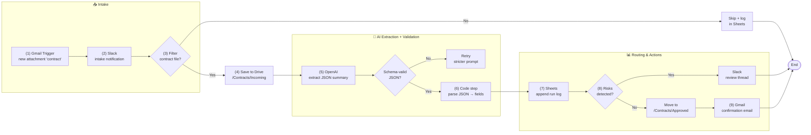
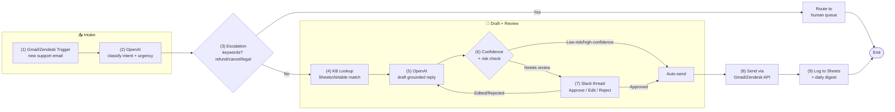

# 🧠 AI Automation Projects
A collection of automation builds combining **Zapier**, **OpenAI**, and clean orchestration to remove manual work and improve accuracy.

---

## ⚙️ Contract Processing Bot
**Type:** Document Intelligence  
**Stack:** Zapier, OpenAI, Google Drive, Gmail, Slack, Google Sheets  

This bot automates contract intake and review—extracting key clauses, identifying risks, logging results, and routing approvals.

**Highlights**
- 80–90% reduction in contract triage time  
- Real-time Slack alerts for risky clauses  
- Seamless Google Drive + Sheets tracking

### 🧩 Workflow Diagram

### ⚙️ Contract Processing Bot — Diagram

**Workflow Steps**

1. **Trigger:** Gmail — new attachment containing “contract”
2. **Notify:** Send immediate Slack notification (intake)
3. **Filter:** Only process contract files (skip & log others)
4. **Store:** Upload to Google Drive → `/Contracts/Incoming`
5. **Extract:** OpenAI step creates JSON summary (parties, dates, amounts, renewal, risks)
6. **Parse:** Code by Zapier converts JSON to typed fields
7. **Log:** Append all run details to Google Sheets
8. **Route:** If risks found → Slack human review thread; else continue
9. **Confirm:** Send email confirmations for auto-approved contracts

---

## 📧 Support Email Agent
**Type:** Agentic Workflow  
**Stack:** Zapier, OpenAI, Gmail, Zendesk, Slack, Google Sheets  

This agent triages every inbound support email, drafts a reply grounded in your knowledge base, and routes anything customer-facing through a one-click Slack approval before it ever leaves the outbox.

**Highlights**
- 24/7 first-response coverage — no ticket sits untouched overnight  
- Human-in-the-loop approval keeps a person accountable for every reply  
- Confidence-based routing sends only low-risk replies (e.g., password resets) automatically  
- Daily Slack digest tracks response time and escalation rate

### 🧩 Workflow Diagram

### 📧 Support Email Agent — Diagram

**Workflow Steps**

1. **Trigger:** Gmail/Zendesk — new inbound support email
2. **Classify:** OpenAI scores intent (billing, technical, general) and urgency
3. **Escalation check:** Refund/cancel/legal/angry-sentiment keywords route straight to a human, bypassing AI drafting
4. **Retrieve:** Pull the matching FAQ/knowledge-base article via lookup table
5. **Draft:** OpenAI generates a reply grounded in the matched KB content, in brand voice
6. **Confidence check:** Low-risk, high-confidence replies (e.g., password reset) go straight to send
7. **Human-in-the-loop:** Everything else posts to a Slack thread with Approve / Edit / Reject actions
8. **Send:** Approved replies go out via the Gmail/Zendesk API
9. **Log & report:** Every reply logged to Sheets; daily Slack digest shows volume, response time, escalation rate

---

## 🗒️ Meeting Intelligence & Action-Item Agent
**Type:** Agentic Workflow + Document Intelligence  
**Stack:** FastAPI, OpenAI (GPT-4o-mini), Whisper, MongoDB, Slack API, Notion/Asana API  

Meetings generate decisions and action items that usually die in someone's notes app. This service listens for a finished meeting, turns the recording or transcript into structured minutes, and pushes every action item — with an owner and a due date — straight into the team's task tool.

**Highlights**
- Cuts meeting write-up time from ~20 minutes to under 2  
- Action items land in Notion/Asana automatically, no manual re-typing  
- Weekly rollup flags overdue items by owner, closing the accountability gap  
- Searchable meeting history in MongoDB — "what did we decide about X?" answered in seconds

### 🧩 Workflow Diagram

### 🗒️ Meeting Intelligence Agent — Diagram

**Workflow Steps**

1. **Trigger:** Zoom/Teams webhook fires when a recording is ready (or a transcript is uploaded manually)
2. **Transcribe:** Whisper API converts audio to text if a transcript wasn't already provided
3. **Send to LLM:** FastAPI service forwards the transcript for structured extraction
4. **Extract:** GPT-4o-mini pulls out a summary, key decisions, and action items (task, owner, due date)
5. **Validate:** Schema check on the returned JSON; retry with a stricter prompt on malformed output
6. **Store:** Structured meeting record saved to MongoDB for searchable history
7. **Create tasks:** FastAPI calls the Notion/Asana API to create one task per action item, tagged to the right owner
8. **Notify:** Clean summary + action item list posted to the team's Slack channel
9. **Track & digest:** Weekly cron checks the DB for items past due date and Slack-DMs each owner, with a rollup to the meeting organizer
    
